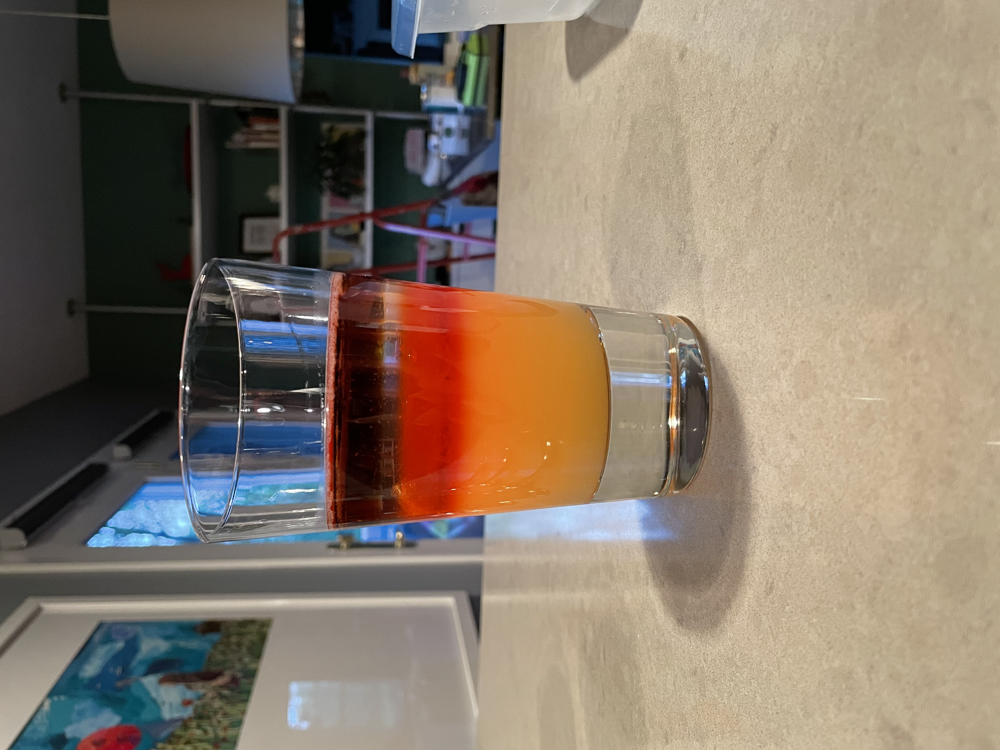

## Cocktails

I really enjoy making fun cocktails. These are some of my favorite creations thus far.

And yes, I do make cocktails without bubbles...I just haven't taken any good pictures of them.

This is a gin and tonic from The Aviary's cocktail book. It uses gin, tonic, and green chartreuse for the drink itself, with homemade
cucumber popping boba.

This is another one from The Aviary cocktail book, the Jungle Bird. It's layers of pineapple juice, campari, white rum, and dark rum, with rum infused popping boba
bubbles suspended on the border between the campari and white rum.

This was inspired by S1 E6 of Drink Masters on Netflix--I learned that there are ways to make "caviar" out of any cocktail!
This one is a deconstructed espresso martini, comprised of vanilla vodka jelly with coffee caviar.

Another caviar cocktail--this was my first sucessful experiment with the technique. The bubbles are comprised of white rum, strawberry syrup, and lime.

Here's one I call "The Big Caper". It's a riff on a Mojito--white rum, tonic water, lime, sugar, and orange-mint caviar. The end result looks a lot like a jar of capers, which I thought was super fun.

This was my second time making the Aviary's gin and tonic, but with a slight twist. The gin is infused with butterfly pea flower tea
to turn it blue-violet, and then layered on top of the drink. As the drink is mixed, the acidity of the drink causes the gin to change
colors from blue-violet to pink-lilac.
