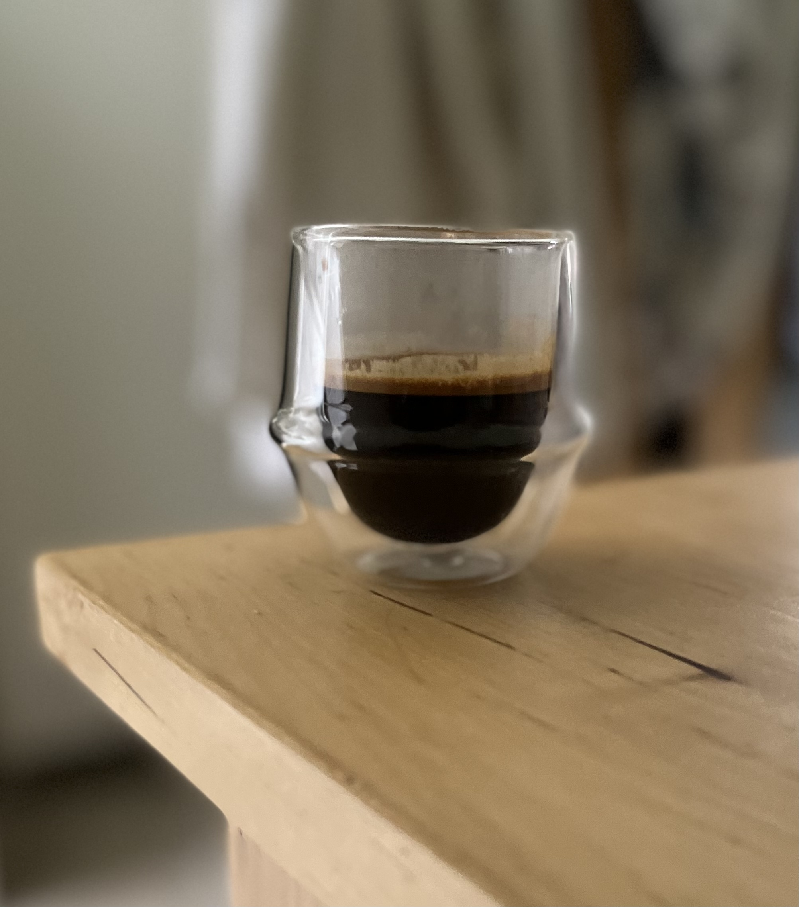
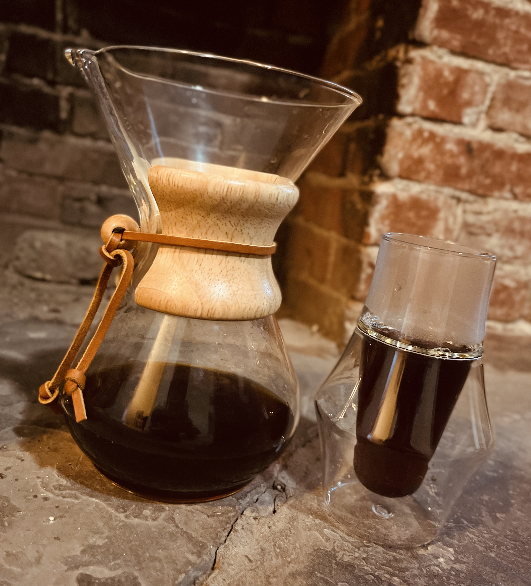
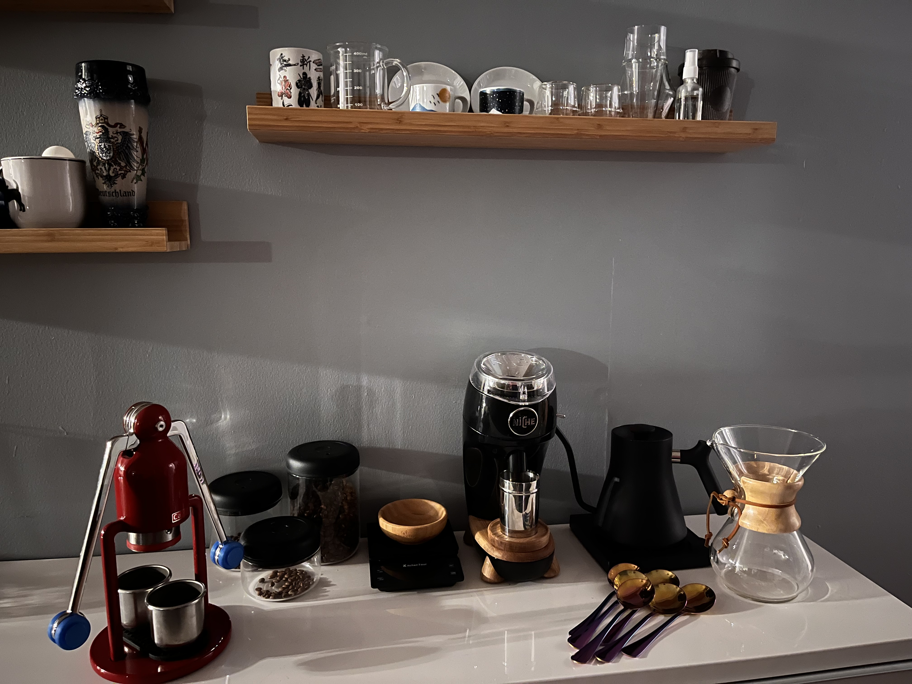
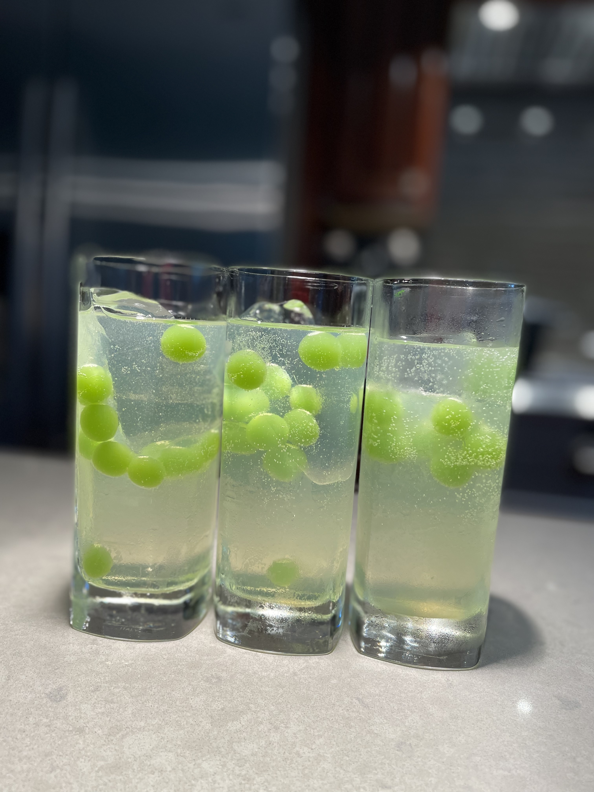
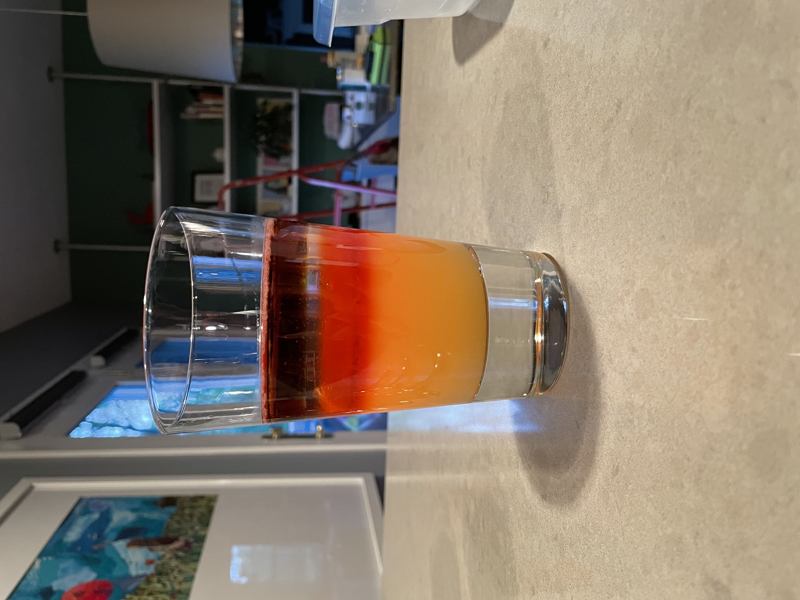

## The Best Coffee Shop in Pittsburgh

People often ask me "you're really into coffee so you must know a lot about coffee shops -- what's your favorite one in Pittsbugh?" I wish there was a simple answer, but it depends on what kind of drink you're looking for. I've been working on this list for a while, although it's still a work in progress. If I don't have a ranking for a category, it's not because I've never had the drink, but rather because I haven't (yet) found a place that's good enough in that area to put it on the list. I'm definitely always open to recommendations!

Note that I personally really enjoy both fruity and fermented notes in coffee, and I don't love darker notes. If you're a huge dark roast fan you might disagree with some of these choices.

### Drink Rankings

- **Best Straight Espresso**: Definitely [Redhawk Coffee](https://maps.app.goo.gl/DePYiuv6np1JnZ2C8), they do a great job with flavorful shots with fruity notes.
- **Best Hot Latte**: [Abolition Coffee](https://maps.app.goo.gl/BUqGUC7Zw3Bavjot9). It's one guy and his coffee shop, and he does an absolutely terrific job. Hours are kinda funky -- you can't roll in here at any time like you would a Starbucks.
- **Best Iced Latte**: Still looking for a place -- we're not quite to iced drink season and I don't have a great memory of where I liked last season, so this spot will have to wait until the summer.
- **Best Iced Seasonal Drinks**: Previously Adda, but now actively searching for something new.
- **Best Hot Seasonal Drinks**: [Arriviste Coffee](https://maps.app.goo.gl/XjRXDpzC7Hvu6ikR9) in Shadyside has super fun specialty drinks. I feel like a really good specialty drink is more than just making a cool syrup and throwing it in a latte. Arriviste definitely does this (although they also have many cool house-made syrups!).
- **Best Pourover**: Tentatively [Ghost Coffee Collab](https://maps.app.goo.gl/9vyBomgjoSNPaY7s9). They've won awards for their pour overs in the past, but I need to go a few more times to confirm the spot.
- **Best Espresso Tonic**: This is one of my favorite drinks, and the bar is pretty high. I'm still looking for somewhere good enough to make the list.
- **Best Drip Coffee**: I'd give it to [Redhawk Coffee](https://maps.app.goo.gl/DePYiuv6np1JnZ2C8) for now, but actively looking for more.

### Other Rankings

- **Best Latte Art**: It's [Arriviste Coffee](https://maps.app.goo.gl/XjRXDpzC7Hvu6ikR9), I don't know how you can beat their baristas.
- **Best Ambiance**:
- **Best Beans**: I can't in good conscience give a recommendation, since this is so dependent on personal preference. That said, my standard is [Redhawk Coffee](https://maps.app.goo.gl/DePYiuv6np1JnZ2C8), but I've recently been enjoying beans from [Commonplace Coffee](https://maps.app.goo.gl/1VPzn5ecBUnQu2p76). [Ghost Coffee Collab](https://maps.app.goo.gl/9vyBomgjoSNPaY7s9) also has a ton of very interesting beans, but I haven't had the opportunity to try them yet.

-----

## Coffee
I first really got into coffee while studying abroad in Japan! My host family founded [Kariomons Coffee Roasters](https://kariomons.com/),
so I had a great experience learning to appreciate coffee while staying with them. My favorite coffee shop in Pittsburgh is [Redhawk Coffee](https://www.redhawkcoffee.com/);
I have yet to find a cafe with a better espresso.

#### Gallery

#### Setup

I'm using a [Niche Zero](https://www.nichecoffee.co.uk/) grinder with a [Fellow Stagg EKG](https://fellowproducts.com/) for my coffee.
For espresso drinks, I use a [Cafelat Robot](https://www.youtube.com/watch?v=11ZSXVZbQbA) with the [Subminimal Nanofoamer](https://subminimal.com/products/nanofoamer).

------
## Cocktails

I really enjoy making fun cocktails. These are some of my favorite creations thus far.

This is a gin and tonic from The Aviary's cocktail book. It uses gin, tonic, and green chartreuse for the drink itself, with homemade
cucumber popping boba.

This is another one from The Aviary cocktail book, the Jungle Bird. It's layers of pineapple juice, campari, white rum, and dark rum, with rum infused popping boba
bubbles suspended on the border between the campari and white rum.

This was inspired by S1 E6 of Drink Masters on Netflix--I learned that there are ways to make "caviar" out of any cocktail!
This one is a deconstructed espresso martini, comprised of vanilla vodka jelly with coffee caviar.

Another caviar cocktail--this was my first sucessful experiment with the technique. The bubbles are comprised of white rum, strawberry syrup, and lime.

Here's one I call "The Big Caper". It's a riff on a Mojito--white rum, tonic water, lime, sugar, and orange-mint caviar. The end result looks a lot like a jar of capers, which I thought was super fun.

This was my second time making the Aviary's gin and tonic, but with a slight twist. The gin is infused with butterfly pea flower tea
to turn it blue-violet, and then layered on top of the drink. As the drink is mixed, the acidity of the drink causes the gin to change
colors from blue-violet to pink-lilac.
