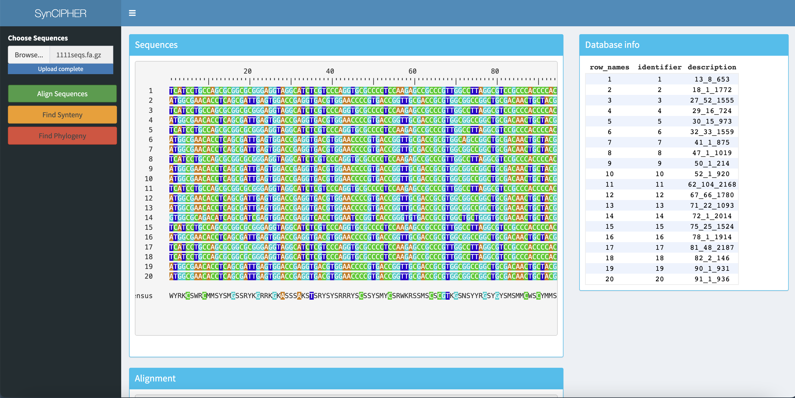
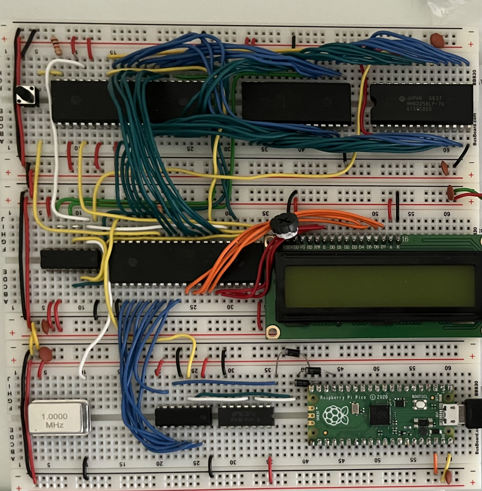
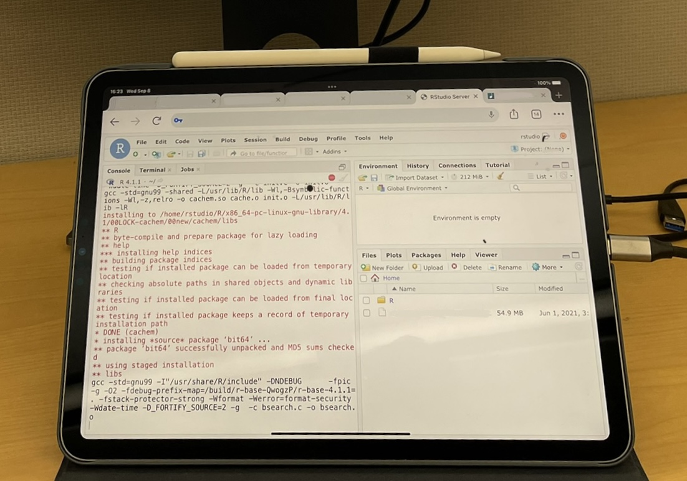

------

## Software

### 65C02 Emulator

I wrote an emulator in C for 65C02 systems. The full code is available [on GitHub](https://github.com/ahl27/65C02Emulator). This program implements a GUI to monitor memory while executing programs, as well as complete emulation of all 6502 and 65C02 Rockwell/WDC opcodes. More details are available [on my blog](https://www.ahl27.com/tags/#emulator).

### SynCIPHER Web App

In the process of developing an `R Shiny` app to make analysis with `DECIPHER` and `SynExtend` simpler for end-users. Code is available at https://github.com/ahl27/SYNCIPHER-app, and the end results will be publicly released soon!

### Academic Paper Finder 
I wrote [this script](https://github.com/ahl27/findPapers) to discover more papers similar to what I'm currently reading. It takes as input a collection of PubMed ID's and search terms, and then traverses the network of citations to find more papers containing the search query. It then uses TF-IDF to convert each paper's abstract into a vector, and then clusters the result with K-means clustering. I wanted this to run on my iPad, so I used Pythonista, which unfortunately does not have access to most widely used libraries for NLP (such as pandas or scikit-learn). As a result, everything is implemented from scratch, including TF-IDF and K-means. 

In the future I'm going to investigate hierarchical clustering methods (ex. UPGMA), using SciBERT for clustering, and having the script search for terms for you (removing the need for initial PubMed IDs to search from).

### Whitespace Interpreter
I'm a big fan of esoteric languages, and one that really caught my eye was [Whitespace](https://en.wikipedia.org/wiki/Whitespace_(programming_language)), a Turing-complete programming language using only whitespace characters (space, tab, and return). I wrote up [this interpreter](https://github.com/ahl27/whitespacehttps://github.com/ahl27/whitespace) in Python for running Whitespace code, mainly as an exercise for learning how interpreters work. One of the big challenges was that popular text editor programs automatically reformat whitespace characters (ex. tabs to spaces), which immediately ruins Whitespace programs.

------
## Hardware
------
### Keyboards

I love building mechanical keyboards (and honestly I have too many at this point). Pictured are my favorites; at some point I'll get them all up here. My current work keyboard is the Helidox Corne, and my main WFH keyboard is the Vault35.

**Vault35**

Black cerakoted aluminum base, Gateron Black switches, and MT3 Operator caps.

**Bully**

Gasket mounted 40% keyboard with black cerakoted base, Gateron Oil King switches, and MT3 Black Speech caps.

**QAZ/Qull**

Cherry MX Black switches, MT3 BoW and WoB caps, and artisan caps from [Asymplex](https://www.asymplex.xyz/). 

**Waterfowl**

Momoka Frog switches, nice!nanos, and the remainder of the MT3 BoW and WoB caps from the Qull. My first wireless!

**Helidox Corne**

Cherry MX Silent Black switches with o-rings, pictured with DSA caps but currently using MT3 Godspeed.

**OLKB Preonic**

Cherry silent red switches, XDA caps.

**Big Dill Extended v2**

Cherry silent red switches, XDA caps.

**Tofu 65**

Gateron brown switches, KBDfans OEM caps, brass weight. My first keyboard!

&nbsp;

&nbsp;

### 6502 Breadboard Computer

I built this computer following [Ben Eater's](https://eater.net/) guides on YouTube. It's a breadboard computer using a 65c02 microprocessor, with 32KB of RAM and 16Kb of ROM. Ben Eater initially connected a keyboard via PS/2, but I wanted my computer to be able to communicate with USB protocols. I used a Raspberry Pico to build a USB-to-PS/2 decoder that translates USB Keyboard input into serial PS/2 codes.

### Web Server

I built a web server to centralize my files, gain some experience with LAMP stacks, and have a robust compute environment that I could access remotely from something like an iPad. My web server hosts NextCloud to store my files on, and runs RStudio Server edition on a virtual machine. 

I'm interested in adding on a small supercomputer cluster with something like Kubernetes on Raspberry Pis for prototyping, though unfortunately due to supply chain shortages this addition is currently on hold.
