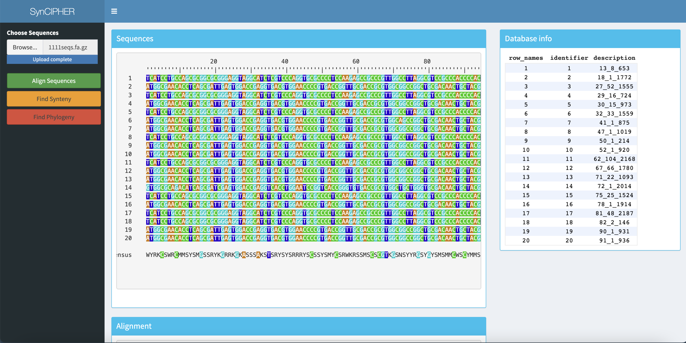

------

This page details some of software-related side projects I've worked on for fun. A description of the research projects I do for my work can be found on the [Research page](https://www.ahl27.com/research/). **Note:** some of my most interesting work is on [my blog page](https://www.ahl27.com/blog)!

-----
## Programming Languages
-----

### Froth

`froth` is a Forth implementation that runs on top of R! You can download it from CRAN, and learn to use it by checking out [my tutorials](https://www.ahl27.com/tutorials).

-----

### Whitespace Interpreter
I'm a big fan of esoteric languages, and one that really caught my eye was [Whitespace](https://en.wikipedia.org/wiki/Whitespace_(programming_language)), a Turing-complete programming language using only whitespace characters (space, tab, and return). I wrote up [this interpreter](https://github.com/ahl27/whitespacehttps://github.com/ahl27/whitespace) in Python for running Whitespace code, mainly as an exercise for learning how interpreters work. One of the big challenges was that popular text editor programs automatically reformat whitespace characters (ex. tabs to spaces), which immediately ruins Whitespace programs.

-----
## Other Projects
-----

### Web Server

I built a web server to centralize my files, gain some experience with LAMP stacks, and have a robust compute environment that I could access remotely from something like an iPad. My web server hosts NextCloud to store my files on, and runs RStudio Server edition on a virtual machine.

I'm interested in adding on a small supercomputer cluster with something like Kubernetes on Raspberry Pis for prototyping, though unfortunately due to supply chain shortages this addition is currently on hold.

-----

### SynCIPHER Web App

In the process of developing an `R Shiny` app to make analysis with `DECIPHER` and `SynExtend` simpler for end-users. Code is available at https://github.com/ahl27/SYNCIPHER-app, and the end results will be publicly released soon!

-----

### Academic Paper Finder
I wrote [this script](https://github.com/ahl27/findPapers) to discover more papers similar to what I'm currently reading. It takes as input a collection of PubMed ID's and search terms, and then traverses the network of citations to find more papers containing the search query. It then uses TF-IDF to convert each paper's abstract into a vector, and then clusters the result with K-means clustering. I wanted this to run on my iPad, so I used Pythonista, which unfortunately does not have access to most widely used libraries for NLP (such as pandas or scikit-learn). As a result, everything is implemented from scratch, including TF-IDF and K-means.

In the future I'm going to investigate hierarchical clustering methods (ex. UPGMA), using SciBERT for clustering, and having the script search for terms for you (removing the need for initial PubMed IDs to search from).
